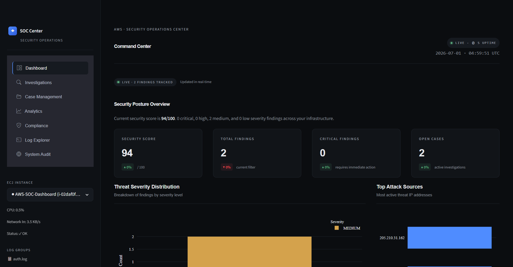

# SOC Dashboard

A Streamlit-based Security Operations Center dashboard for real-time monitoring of AWS infrastructure.

## Overview

The dashboard aggregates security events from three AWS data sources — CloudWatch Logs, CloudWatch Metrics, and CloudTrail — and presents them through a unified interface with seven functional views:

| Tab              | Purpose                                                                                       |
| :--------------- | :-------------------------------------------------------------------------------------------- |
| **Dashboard**    | Overview with KPIs, severity charts, attacker table, activity feed                            |
| **Investigations** | Filterable findings table with status and deduplication                                     |
| **Case Management** | Incident workflow — assign analyst, add notes, close/resolution                            |
| **Analytics**    | Severity distribution, top sources, targeted accounts, MITRE mapping                          |
| **Compliance**   | Risk & compliance framework with 10 security controls                                         |
| **Log Explorer** | Raw CloudWatch logs with severity filtering and Excel export                                  |
| **System Audit** | Live EC2 metrics — CPU, network, status checks                                                |

### Key capabilities

- **Brute-force consolidation** — ≥ 5 failed SSH attempts from the same IP are consolidated into a single incident with attack count
- **MITRE ATT&CK mapping** — Every finding mapped to a technique and tactic
- **Trusted-user filtering** — SSH keys and IAM users registered as trusted are excluded from findings
- **Case management** — Full incident lifecycle (OPEN → INVESTIGATING → CONTAINED → RESOLVED / FALSE_POSITIVE)
- **Compliance controls** — 10 live checks covering IAM, logging, networking, and backup posture
- **Auto-refresh** — Dashboard refreshes every 30 seconds

## Architecture

```
┌─────────────────────────────────────────────────────────────────────────────────────────────────┐
│                                                                                                 │
│  ┌──────────────────────┐       ┌─────────────────────┐       ┌─────────────────────────────┐  │
│  │  Monitored EC2       │       │  SOC Dashboard       │       │  AWS Services              │  │
│  │  (EC2 Instance)      │       │                      │       │                            │  │
│  │                      │       │  Port 8501           │       │  ┌──────────────────────┐  │  │
│  │  /var/log/auth.log   │──────▶│  systemd (soc-       │──────▶│  │ CloudWatch Logs      │  │  │
│  │  /var/log/syslog     │       │  dashboard.service)  │       │  └──────────────────────┘  │  │
│  │                      │       │                      │       │                            │  │
│  │  CloudWatch Agent    │       │  ┌────────────────┐  │       │  ┌──────────────────────┐  │  │
│  │  ──────────────────  │       │  │  Streamlit     │  │       │  │  CloudWatch Metrics  │  │  │
│  │                      │       │  │  App           │  │       │  └──────────────────────┘  │  │
│  └──────────────────────┘       │  │                │  │       │                            │  │
│                                 │  │                │  │       │  ┌──────────────────────┐  │  │
│                                 │  │  Tabs:         │  │       │  │  EC2 Describe API    │  │  │
│                                 │  │  7 views       │  │       │  └──────────────────────┘  │  │
│                                 │  │                │  │       │                            │  │
│                                 │  └────────────────┘  │       │  ┌──────────────────────┐  │  │
│                                 │                      │       │  │  CloudTrail          │  │  │
│                                 │  ┌────────────────┐  │       │  └──────────────────────┘  │  │
│                                 │  │  IAM Role      │  │       └─────────────────────────────┘  │
│                                 │  └────────────────┘  │       ┌─────────────────────────────┐  │
│                                 └──────────────────────┘       │  AWS APIs (boto3)          │  │
│                                                                 └─────────────────────────────┘  │
│                                                                                                 │
└─────────────────────────────────────────────────────────────────────────────────────────────────┘
```

**Data flow:**

1. Monitored EC2 instance ships `/var/log/auth.log` to CloudWatch via CloudWatch Agent
2. Dashboard queries CloudWatch Logs Insights for SSH events every 30 seconds
3. CloudTrail events are polled for login and key management activity
4. CloudWatch Metrics provide EC2 CPU, network, and status data
5. All data is merged, deduplicated, and presented across seven tabs

## Data sources

| Source                   | What it provides                                                                                      |
| :----------------------- | :---------------------------------------------------------------------------------------------------- |
| CloudWatch Logs Insights | SSH authentication events (auth.log), sudo activity, privilege escalation                           |
| CloudWatch Metrics       | CPU, network I/O, status checks for monitored EC2 instances                                           |
| CloudTrail               | Console login events, access key creation, IAM activity                                               |

## Requirements

| Component            | Minimum                |
| :------------------- | :--------------------- |
| OS                   | Ubuntu 22.04+ or Debian 11+ |
| Python               | 3.10+                  |
| Memory               | 512 MB RAM (dashboard idle) |
| AWS credentials      | IAM role on EC2 or `~/.aws/credentials` |
| CloudWatch Logs      | `/var/log/auth.log` shipped via CloudWatch Agent |
| Port                 | 8501 (Streamlit default) |

## Installation

### 1. Clone and install

```bash
git clone https://github.com/<org>/soc-dashboard.git
cd soc-dashboard
python3 -m venv .venv
source .venv/bin/activate
pip install -r requirements.txt
```

### 2. Configure environment

Create a `.env` file in the project root:

```env
TRUSTED_FINGERPRINTS=SHA256:xxx,SHA256:yyy
TRUSTED_CLOUDTRAIL_USERS=analyst-user
```

| Variable                   | Description                                                          |
| :------------------------- | :------------------------------------------------------------------- |
| `TRUSTED_FINGERPRINTS`     | SSH key fingerprints to exclude from findings                        |
| `TRUSTED_CLOUDTRAIL_USERS` | IAM usernames whose ConsoleLogin events are excluded                 |

### 3. Run

**Local development**
```bash
streamlit run dashboard.py
```
Opens at `http://localhost:8501`.

**Production (systemd)**

Create `/etc/systemd/system/soc-dashboard.service`:

```ini
[Unit]
Description=SOC Dashboard
After=network.target

[Service]
User=<app-user>
WorkingDirectory=/path/to/soc-dashboard
ExecStart=/path/to/soc-dashboard/.venv/bin/python -m streamlit run dashboard.py --server.port 8501 --server.headless true --server.fileWatcherType none
Restart=always
RestartSec=10

[Install]
WantedBy=multi-user.target
```

```bash
sudo systemctl daemon-reload
sudo systemctl enable --now soc-dashboard
```

View logs: `sudo journalctl -u soc-dashboard -f`

## Threat detection logic

### SSH events

| Event                                                | Severity | Finding Type                  |
| :--------------------------------------------------- | :------- | :---------------------------- |
| Accepted publickey — untrusted fingerprint           | CRITICAL | UNAUTHORIZED_KEY_ACCEPTED     |
| Accepted publickey — trusted key, untrusted user     | HIGH     | ANOMALOUS_USER_LOGIN          |
| Accepted publickey — trusted key & user              | —        | Skipped                       |
| Failed password / publickey                          | HIGH     | FAILED_PASSWORD / FAILED_PUBLICKEY |
| Invalid user                                         | HIGH     | INVALID_USER                  |
| Brute-force (≥5 failures from same IP)               | CRITICAL | BRUTE_FORCE (consolidated)    |
| Suspicious sudo commands                             | MEDIUM   | PRIVILEGE_ESCALATION          |

### CloudTrail events

| Event                                    | Severity | Filtered?  |
| :--------------------------------------- | :------- | :--------- |
| ConsoleLogin — Failure                   | HIGH     | Always     |
| ConsoleLogin — Success (trusted user)    | —        | Skipped    |
| ConsoleLogin — Success (untrusted user)  | MEDIUM   | Always     |
| CreateAccessKey                          | LOW      | Always     |

## MITRE ATT&CK mapping

| Technique      | Description                          | Finding                              |
| :------------- | :----------------------------------- | :----------------------------------- |
| T1110          | Brute Force                          | SSH brute-force                      |
| T1110.001      | Password Guessing                    | Failed password / publickey          |
| T1078.004      | Valid Accounts: Cloud Accounts       | ConsoleLogin failures                |
| T1098.004      | SSH Authorized Keys                  | Unauthorized key acceptance          |
| T1098          | Account Manipulation                 | CreateAccessKey                      |
| T1059          | Command and Scripting Interpreter    | Suspicious sudo                      |
| T1548          | Abuse Elevation Control Mechanism    | Privilege escalation                 |
| T1046          | Network Service Scanning             | No identification string             |
| T1562.001      | Disable or Modify Tools              | Connection reset                     |

## Security score

The dashboard calculates a 0–100 security posture score by deducting points from a baseline of 100 based on active findings:

| Severity | Deduction per finding | Maximum deduction |
| :------- | :-------------------- | :---------------- |
| CRITICAL | −5 points             | −40               |
| HIGH     | −3 points             | −25               |
| MEDIUM   | −1.5 points           | −15               |
| LOW      | −0.5 points           | −10               |

The score floors at 0 and rounds down to the nearest integer.

## Screenshots


